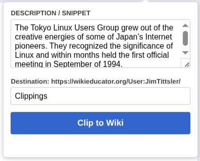

# WE-clipper

This is a simple web browser extension for clipping web page text
to a WikiEducator user subpage. It simplifies creating a public
bookmark list.

---

## Features

- appends page title, link, and text to the user subpage of your choice
- text can be selected in the browser, or fallsback to the first paragraph
- uses a custom template for each subpage, allowing formatting

## Installation & Setup

This extension is distributed from the GitHub "Releases" page.

### Google Chrome, Microsoft Edge, Vivaldi, etc.

1. Download the latest release *.zip file
2. Unzip the file in some permanent location
3. Open the browser's Tools > Extensions page
4. Click "Load unpacked" and select the unzipped directory

### Firefox

1. Download the latest release *.xpi file
2. Install the file in Firefox's Add-ons Manager

## Usage ##

> [!NOTE]
> You must already be logged in to WikiEducator in your current
> browser session.

1. Navigate to a page you want to clip
2. Optionally select the text you want to clip
3. Confirm the subpage you want to clip to
4. Click the "Clip to WikiEducator" button

## Templating ##

Create a `/Template` subpage of your clipping subpage. The template
should expect the following parameters (any of which can be discarded):

* `url`
* `title`
* `date` (the date the clipping was made in ISO-8601 format)
* `text` (the clipped text)

